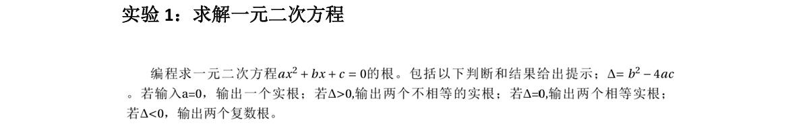
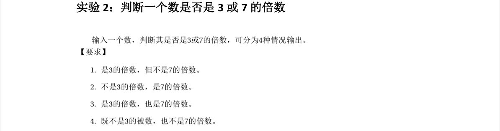
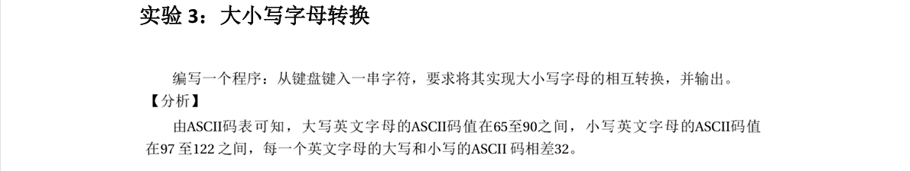
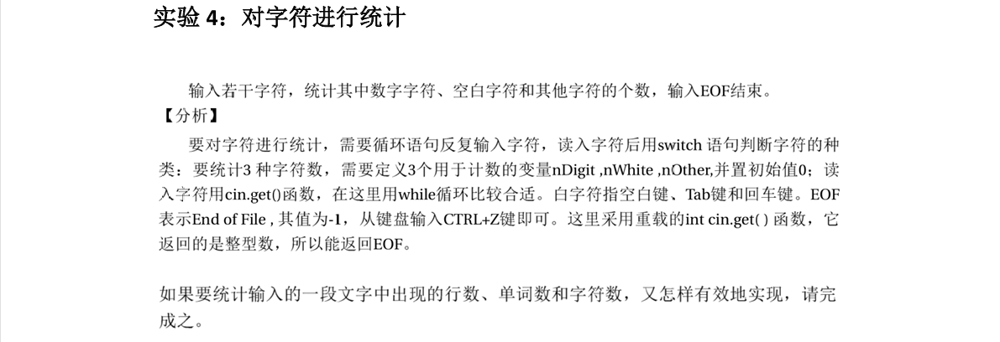

# 实验一：C++ 基础编程练习

本文件夹包含第一次实验的四个题目代码及相关说明。

## 目录
| 编号 | 题目名称 | 源码链接 |
| :--- | :--- | :--- |
| 1 | 求解一元二次方程 | [代码](./src/lab1_1.cpp) |
| 2 | 判断 3 或 7 的倍数 | [代码](./src/lab1_2.cpp) |
| 3 | 大小写字母转换 | [代码](./src/lab1_3.cpp) |
| 4 | 字符统计 | [代码](./src/lab1_4.cpp) |

---

## 题目 1：求解一元二次方程

### 题目描述
编程求解一元二次方程 $ax^2 + bx + c = 0$ 的根。
需要计算判别式 $\Delta = b^2 - 4ac$，并根据以下情况输出结果：

1.  若输入 $a = 0$，输出一个实根。
2.  若 $\Delta > 0$，输出两个不相等的实根。
3.  若 $\Delta = 0$，输出两个相等的实根。
4.  若 $\Delta < 0$，输出两个复数根。

### 题目截图

---

## 题目 2：判断一个数是否是 3 或 7 的倍数

### 题目描述
输入一个整数，判断其是否是 3 或 7 的倍数，并根据以下 4 种情况输出对应的提示信息：

1.  是 3 的倍数，但不是 7 的倍数。
2.  不是 3 的倍数，是 7 的倍数。
3.  是 3 的倍数，也是 7 的倍数。
4.  既不是 3 的倍数，也不是 7 的倍数。

### 题目截图

---

## 题目 3：大小写字母转换

### 题目描述
编写一个程序：从键盘键入一串字符，要求将其实现大小写字母的相互转换，并输出。

**【分析】**
由 ASCII 码表可知：
*   大写英文字母的 ASCII 码值在 65 至 90 之间。
*   小写英文字母的 ASCII 码值在 97 至 122 之间。
*   每一个英文字母的大写和小写 ASCII 码相差 32。

### 题目截图

---

## 题目 4：对字符进行统计

### 题目描述
输入若干字符，统计其中**数字字符**、**空白字符**和**其他字符**的个数，输入 `EOF` 结束。

**【分析】**
*   需要循环语句反复输入字符，读入字符后用 switch 语句判断字符种类。
*   定义 3 个变量 `nDigit`, `nWhite`, `nOther` 并初始化为 0。
*   读入字符建议使用 `cin.get()` 函数，配合 while 循环。
*   **空白字符**指：空格键、Tab 键和回车键。
*   `EOF` (End of File) 值为 -1，键盘输入 `CTRL+Z` 即可模拟。

### 题目截图
