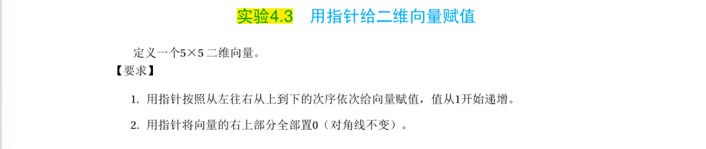
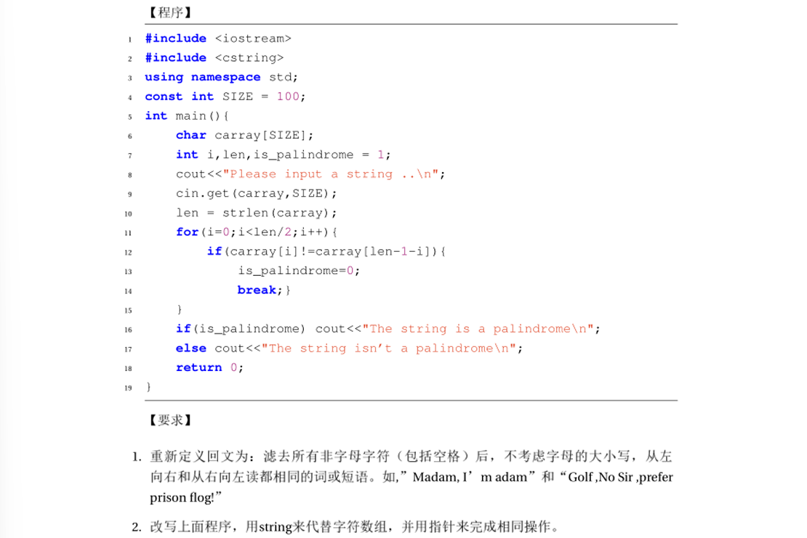
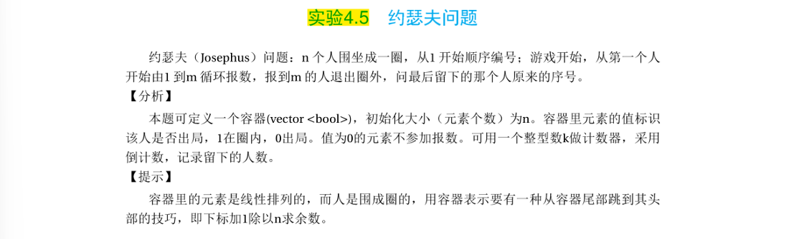

# 实验二：数据结构与指针应用

本文件夹包含第二次实验的四个题目代码及相关说明。重点涉及指针操作、向量（Vector）使用以及字符串处理。

## 目录
| 编号 | 题目名称 | 源码链接 |
| :--- | :--- | :--- |
| 1 | 十进制转二进制 | [代码](./src/lab2_1.cpp) |
| 2 | 二维向量与指针赋值 | [代码](./src/lab2_2.cpp) |
| 3 | 判断回文字符串 | [代码](./src/lab2_3.cpp) |
| 4 | 约瑟夫问题 | [代码](./src/lab2_4.cpp) |

---

## 题目 1：十进制转成二进制

### 题目描述
编写程序输入一个十进制表示的正整数，将其转换成二进制并输出结果。

**【方法】**
采用“除二取余”法，然后倒序排列，高位补零。

### 题目截图

---

## 题目 2：用指针给二维向量赋值

### 题目描述
定义一个 $5 \times 5$ 的二维向量（Vector）。

**【要求】**
1.  用**指针**按照从左往右、从上到下的次序依次给向量赋值，值从 1 开始递增。
2.  用**指针**将向量的**右上部分全部置 0**（对角线不变）。

### 题目截图

---

## 题目 3：判断字符串是否是“回文”

### 题目描述
判断用户输入的字符串是否为“回文”。所谓“回文”是指顺读和反读都一样的串，例如 `12321`、`madam`。

**【进阶要求】**
1.  **重新定义回文**：滤去所有非字母字符（包括空格）后，不考虑字母的大小写，从左向右和从右向左读都相同的词或短语。
    *   例如：`Madam, I'm adam` 和 `Golf, No Sir, prefer prison flog!` 均应被判定为回文。
2.  改写程序，用 `string` 类来代替字符数组，并**用指针**来完成相同操作。

### 题目截图

---

## 题目 4：约瑟夫问题 (Josephus Problem)

### 题目描述
$n$ 个人围坐成一圈，从 1 开始顺序编号；游戏开始，从第一个人开始由 1 到 $m$ 循环报数，报到 $m$ 的人退出圈外，问最后留下的那个人原来的序号。

**【分析】**
*   本题可定义一个容器 `vector<bool>`，初始化大小为 $n$。
*   容器里元素的值标识该人是否出局：`1` 在圈内，`0` 出局。值为 `0` 的元素不参加报数。
*   可用一个整型数 $k$ 做计数器，采用倒计数，记录留下的人数。

**【提示】**
容器里的元素是线性排列的，而人是围成圈的。用容器表示要有一种从容器尾部跳到其头部的技巧，即下标加 1 除以 $n$ 求余数。

### 题目截图
