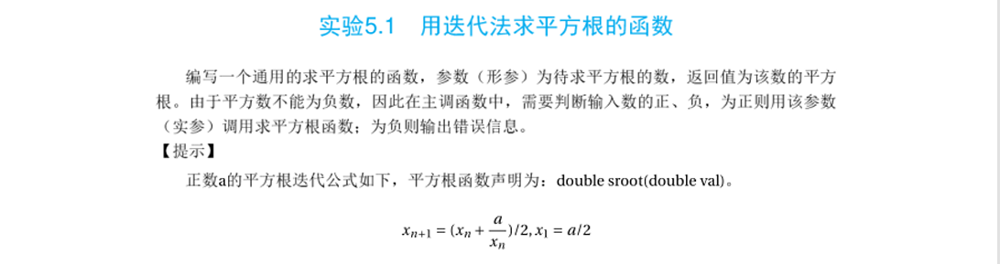
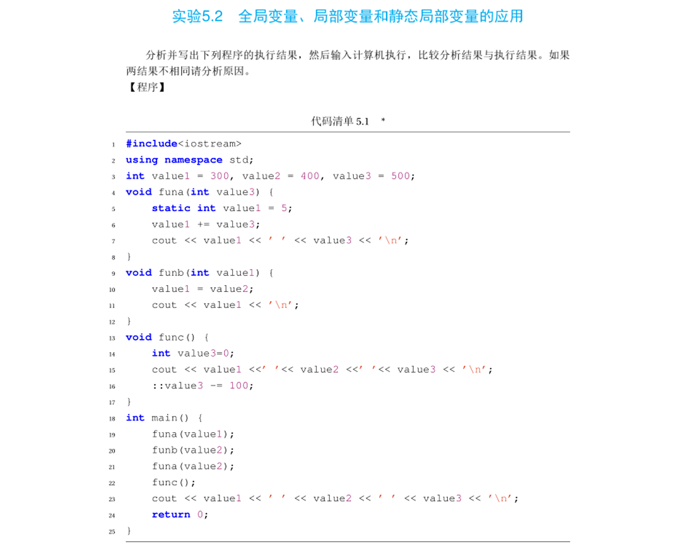
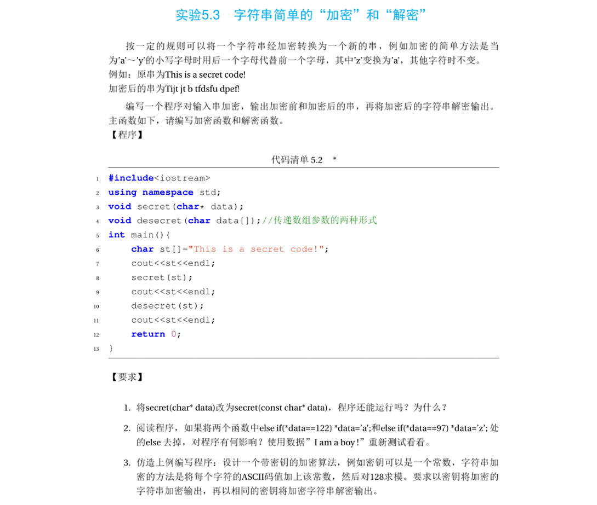
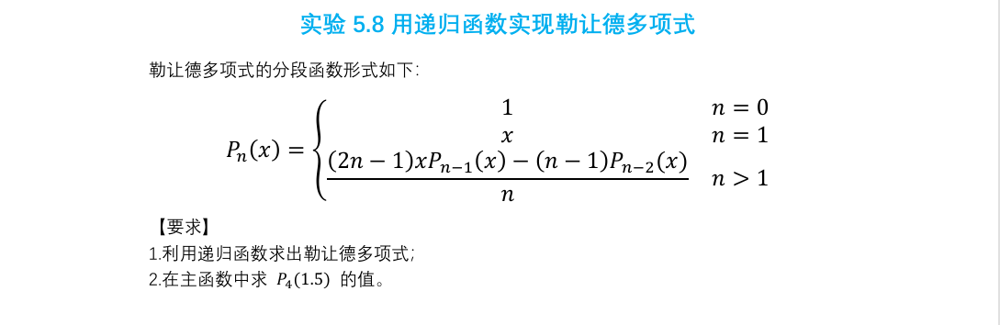

# 实验三：函数应用、作用域与递归

本文件夹包含第三次实验的四个题目代码及相关说明。重点涉及函数的迭代与递归实现、变量的作用域与生命周期、以及字符串加密算法的设计。

## 目录
| 编号 | 题目名称 | 对应书本章节 | 源码链接 |
| :--- | :--- | :--- | :--- |
| 1 | 用迭代法求平方根 | 实验 5.1 | [代码](./src/lab3_1.cpp) |
| 2 | 变量作用域与静态变量 | 实验 5.2 | [代码](./src/lab3_2.cpp) |
| 3 | 字符串加密与解密 | 实验 5.3 | [代码](./src/lab3_3.cpp) |
| 4 | 勒让德多项式 (递归) | 实验 5.8 | [代码](./src/lab3_4.cpp) |

---

## 题目 1：用迭代法求平方根的函数

### 题目描述
编写一个通用的求平方根的函数。
*   **参数**：待求平方根的数（`double val`）。
*   **返回值**：该数的平方根。
*   **主函数逻辑**：判断输入数的正负。若为正，调用函数计算；若为负，输出错误信息。

**【算法提示】**
正数 $a$ 的平方根迭代公式如下（$x_1 = a/2$）：
$$ x_{n+1} = \frac{1}{2} (x_n + \frac{a}{x_n}) $$

### 题目截图

---

## 题目 2：全局变量、局部变量和静态局部变量的应用

### 题目描述
分析并写出下列程序的执行结果，然后输入计算机执行，比较分析结果与执行结果。

**【考察点】**
*   **全局变量**：在所有函数外部定义，生命周期贯穿整个程序。
*   **局部变量**：在函数内部定义，函数结束即销毁。
*   **静态局部变量 (`static`)**：只初始化一次，函数结束后保留数值，下次调用时继续使用。

### 题目截图

---

## 题目 3：字符串简单的“加密”和“解密”

### 题目描述
编写一个程序：设计一个带密钥的加密算法，实现字符串的加密和解密。

**【基础分析】**
原题示例规则：`'a' -> 'b'`, ..., `'z' -> 'a'`（简单的凯撒密码变种）。

**【实验要求】**
1.  **代码分析**：将 `secret(char* data)` 改为 `secret(const char* data)`，程序还能运行吗？为什么？
2.  **逻辑排错**：阅读程序，去掉两个 `else` 分支后，对输入 `"I am a boy!"` 会有什么影响？
3.  **算法设计**：设计一个带密钥的加密算法。
    *   例如：密钥为一个常数，将每个字符的 ASCII 码加上该常数，然后对 128 求模。
    *   要求实现加密和解密输出。

### 题目截图

---

## 题目 4：用递归函数实现勒让德多项式

### 题目描述
利用**递归函数**求出勒让德多项式 $P_n(x)$ 的值，并在主函数中求 $P_4(1.5)$ 的值。

**【数学公式】**
勒让德多项式的分段函数形式如下：

$$
P_n(x) = 
\begin{cases} 
1 & n = 0 \\
x & n = 1 \\
\frac{(2n-1)xP_{n-1}(x) - (n-1)P_{n-2}(x)}{n} & n > 1
\end{cases}
$$

### 题目截图
