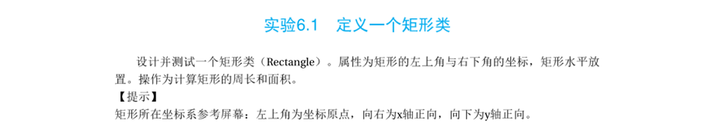
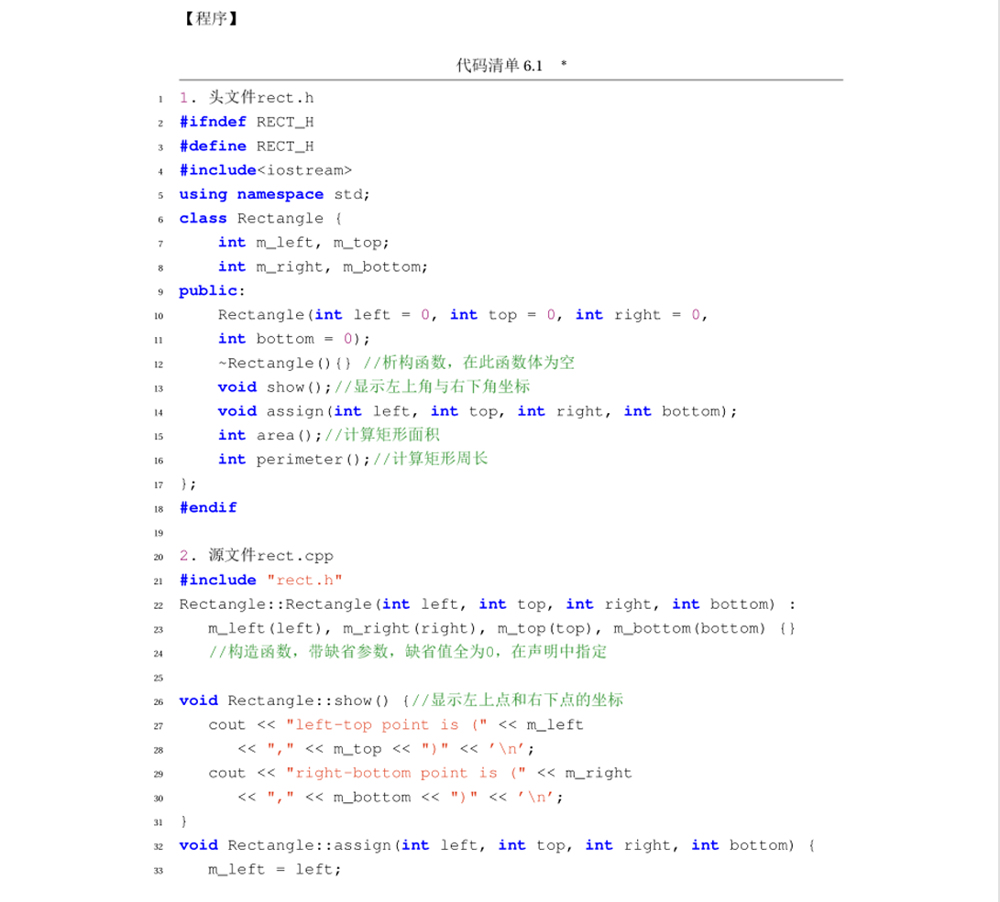
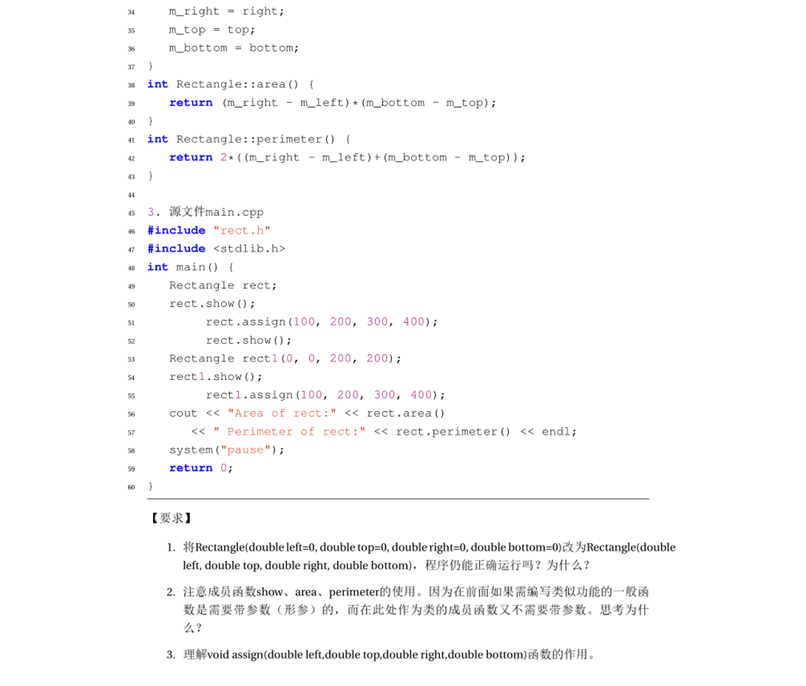
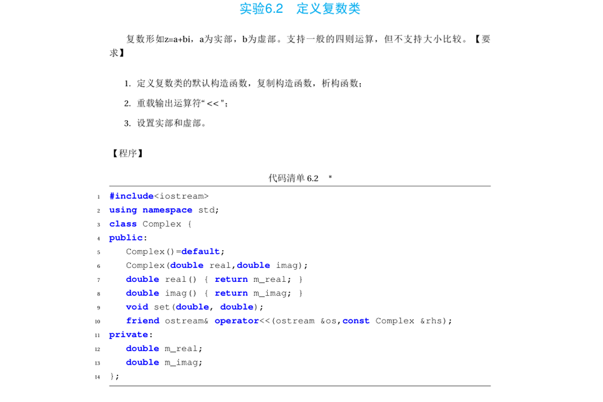
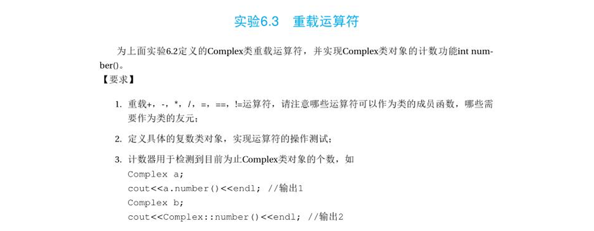
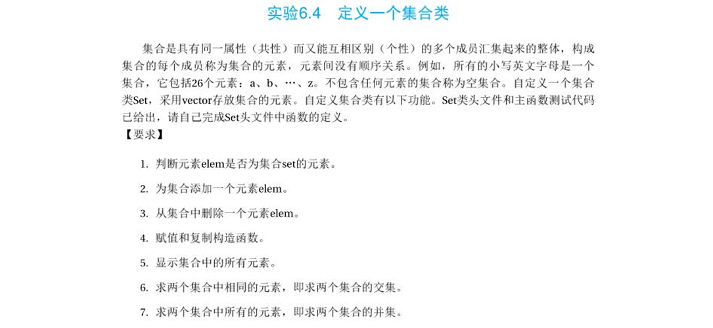

# 实验四：面向对象编程与类设计

本文件夹包含第四次实验的四个题目。本次实验重点在于**类（Class）的定义**、**构造函数与析构函数**、**运算符重载**以及**STL 容器（Vector）**在类中的封装应用。

由于每个题目包含多个文件（头文件与源文件），代码已按题目分文件夹存放。

## 目录
| 编号 | 题目名称 | 对应书本章节 | 源码目录 |
| :--- | :--- | :--- | :--- |
| 1 | 定义一个矩形类 | 实验 6.1 | [打开目录](./src/lab4_1/) |
| 2 | 定义复数类 (基础) | 实验 6.2 | [打开目录](./src/lab4_2/) |
| 3 | 复数类的运算符重载 | 实验 6.3 | [打开目录](./src/lab4_3/) |
| 4 | 定义一个集合类 | 实验 6.4 | [打开目录](./src/lab4_4/) |

---

## 题目 1：定义一个矩形类 (Rectangle)

### 题目描述
设计并测试一个矩形类 `Rectangle`。
*   **属性**：矩形的左上角坐标 `(left, top)` 与右下角坐标 `(right, bottom)`。
*   **操作**：计算矩形的周长 (`perimeter`) 和面积 (`area`)。
*   **坐标系**：参考屏幕坐标系，左上角为原点，向右为 X 轴正向，向下为 Y 轴正向。

**【实验要求】**
1.  修改构造函数默认参数，观察程序运行情况。
2.  分析成员函数 `assign` 与构造函数的异同及存在的必要性。
3.  为类添加复制构造函数 `Rectangle(const Rectangle & rhs)`。

### 题目截图

---

## 题目 2：定义复数类 (Complex)

### 题目描述
定义一个复数类 `Complex`，用于表示形式为 $z = a + bi$ 的复数（$a$ 为实部，$b$ 为虚部）。

**【功能要求】**
1.  定义默认构造函数、带参构造函数、析构函数。
2.  重载输出运算符 `<<`，使其能直接输出复数对象。
3.  设置实部和虚部的接口函数。

### 题目截图

---

## 题目 3：重载运算符 (Operator Overloading)

### 题目描述
在实验 6.2 定义的 `Complex` 类基础上，进一步重载运算符，并实现对象计数功能。

**【要求】**
1.  **运算符重载**：实现 `+`, `-`, `*`, `/`, `=`, `==`, `!=`。需要区分哪些作为成员函数，哪些作为友元函数。
2.  **静态成员**：增加静态数据成员用于统计目前为止 `Complex` 类对象的个数，并提供静态成员函数 `number()` 进行访问。

### 题目截图

---

## 题目 4：定义一个集合类 (Set)

### 题目描述
集合是具有同一属性而又能互相区别的多个成员汇集起来的整体。
自定义一个集合类 `Set`，底层采用 `vector<char>` 存放集合元素（如 'a', 'b', ... 'z'）。

**【功能实现】**
1.  **查**：判断元素 `elem` 是否在集合中 (`is_elem`)。
2.  **增/删**：添加元素 (`insert`)、删除元素 (`erase`)。
3.  **构造**：实现赋值运算和复制构造函数。
4.  **显示**：显示集合中所有元素。
5.  **集合运算**：
    *   **交集** (`common`)：求两个集合中相同的元素。
    *   **并集** (`sum`)：求两个集合中所有的元素（去重）。

### 题目截图

